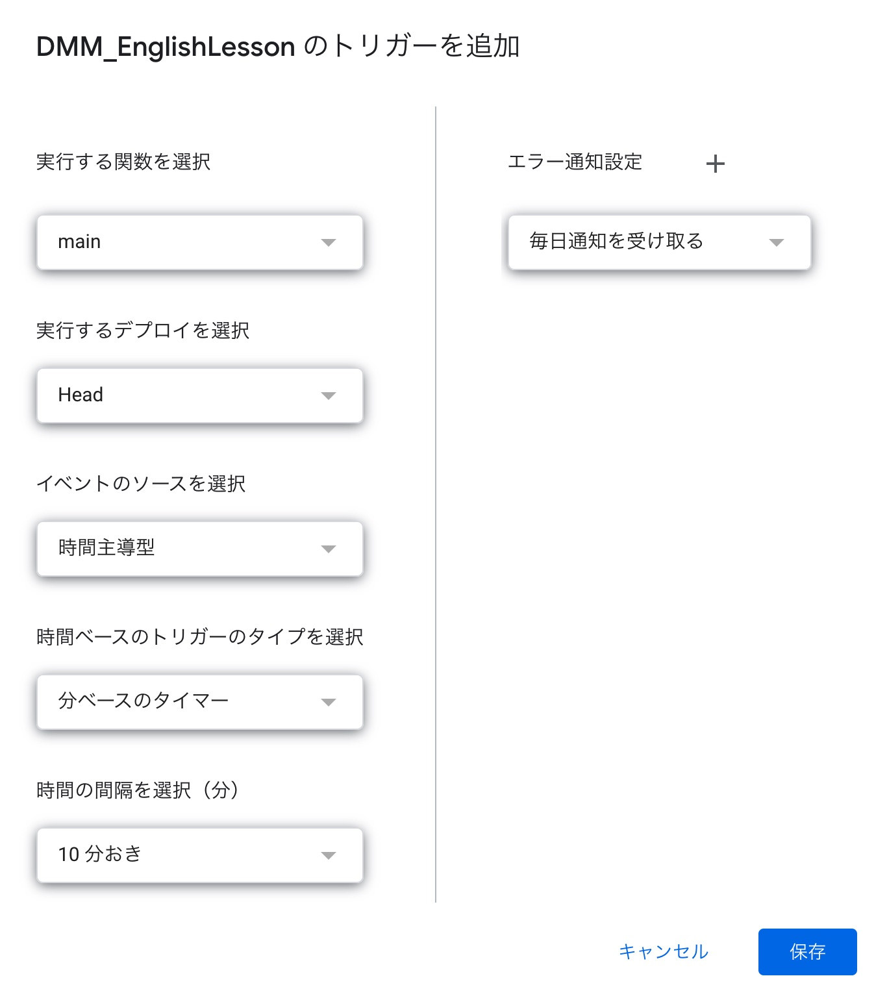

# DMM_EnglishLesson

Detect reservation completion emails from DMM English lesson and register them in Google Calendar.

## Requirements

- Install clasp

```shell
npm i @google/clasp
clasp login
clasp create
# select standalone
```

## Deploy

- push

```shell
clasp push
```

- visit [your project](https://script.google.com/home) and set trigger
